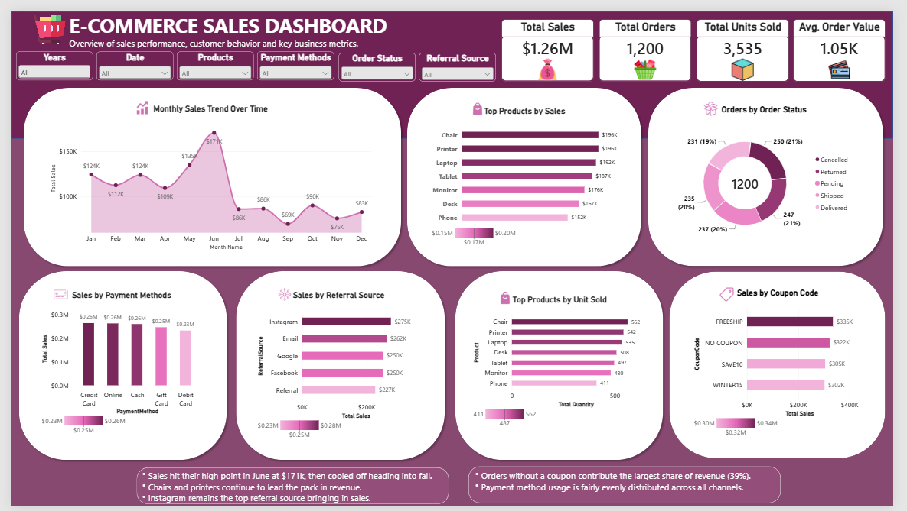

# 🛒 E-Commerce Sales Analysis | Power BI Dashboard

## 📌 Project Overview

This project is the **fourth and final project of my DecodeLabs Internship Program**.

The project focuses on analysing e-commerce sales data and transforming the results into an interactive and visually engaging **Power BI dashboard**.

The analysis explores key areas of business performance, including sales trends, product performance, order status, payment methods, referral sources, coupon codes, and key performance indicators.

The goal of this project was to transform data into meaningful insights that can support better business understanding and decision-making.

---

## 🎯 Project Objectives

The objectives of this analysis were to:

- Analyse overall e-commerce sales performance.
- Calculate key performance indicators (KPIs).
- Track monthly sales trends.
- Identify top-performing products by sales.
- Identify top products by units sold.
- Analyse orders by order status.
- Compare sales across different payment methods.
- Identify the top-performing referral sources.
- Analyse sales performance by coupon code.
- Build an interactive Power BI dashboard to communicate insights clearly.

---

## 🛠️ Tools Used

- Microsoft Power BI
- Microsoft Excel
- Power Query
- DAX
- GitHub

---

# 📊 Dashboard Preview



---

## 📈 Key Performance Indicators

The dashboard provides a quick overview of the overall business performance.

| KPI | Result |
|---|---:|
| 💰 Total Sales | **$1.26M** |
| 🛒 Total Orders | **1,200** |
| 📦 Total Units Sold | **3,535** |
| 💵 Average Order Value | **$1.05K** |

---

# 📅 Monthly Sales Trend

The monthly sales analysis revealed noticeable fluctuations throughout the year.

### Key Findings:

- Sales reached their highest point in **June at approximately $171K**.
- Sales dropped significantly after the June peak.
- **November recorded the lowest sales at approximately $75K**.
- December sales were approximately **$83K**.

These trends can help support future planning around inventory, promotions, and marketing campaigns.

---

# 🛍️ Product Performance

The dashboard analyses products based on both **sales revenue** and **units sold**.

## Top Products by Sales

| Product | Total Sales |
|---|---:|
| 🪑 Chair | **$196K** |
| 🖨️ Printer | **$196K** |
| 💻 Laptop | **$192K** |
| 📱 Tablet | **$187K** |
| 🖥️ Monitor | **$176K** |
| 🪑 Desk | **$167K** |
| 📱 Phone | **$152K** |

### Key Insight

Chair and Printer were the strongest products by sales, contributing approximately **$196K each**.

---

## 📦 Top Products by Units Sold

| Product | Units Sold |
|---|---:|
| Chair | **562** |
| Printer | **542** |
| Laptop | **535** |
| Desk | **508** |
| Tablet | **497** |
| Monitor | **480** |
| Phone | **411** |

### Key Insight

Chair recorded the highest number of units sold, making it a strong performer in both **sales revenue and sales volume**.

---

# 🔄 Orders by Order Status

The dashboard analyses a total of **1,200 orders** across different order statuses.

| Order Status | Number of Orders |
|---|---:|
| Cancelled | **250** |
| Returned | **247** |
| Shipped | **237** |
| Pending | **235** |
| Delivered | **231** |

### Key Insight

The distribution of orders across the different statuses was relatively balanced.

However, **cancelled and returned orders were slightly higher**, highlighting areas that could be investigated further to improve customer satisfaction and order completion.

---

# 💳 Sales by Payment Method

The dashboard compares sales across different payment methods:

- Credit Card
- Online
- Cash
- Gift Card
- Debit Card

### Key Insight

Sales across payment methods were relatively balanced, with **Credit Card, Online, and Cash** generating similar levels of revenue.

This highlights the importance of providing customers with multiple convenient payment options.

---

# 📣 Sales by Referral Source

The analysis also explores where customers were coming from.

## Referral Source Performance

| Referral Source | Total Sales |
|---|---:|
| Instagram | **$275K** |
| Email | **$262K** |
| Google | **$250K** |
| Facebook | **$250K** |
| Referral | **$227K** |

### Key Insight

**Instagram was the strongest referral source**, generating approximately **$275K in sales**.

Email and Google also contributed strongly, showing that multiple marketing and acquisition channels played an important role in driving sales.

---

# 🎟️ Sales by Coupon Code

The dashboard analyses sales performance across different coupon categories.

| Coupon Code | Total Sales |
|---|---:|
| FREESHIP | **$335K** |
| NO COUPON | **$322K** |
| SAVE10 | **$303K** |
| WINTER15 | **$302K** |

### Key Insight

**FREESHIP generated the highest sales** among the coupon categories displayed.

Interestingly, orders without a coupon also generated a significant share of revenue.

---

# 💡 Key Insights

The analysis revealed several important insights:

📌 **June was the highest-performing month**, generating approximately **$171K in sales**.

📌 **Chair and Printer were the top-performing products by sales.**

📌 **Chair recorded the highest number of units sold.**

📌 **Instagram was the strongest referral source.**

📌 **Payment methods generated relatively balanced sales performance.**

📌 **FREESHIP was the highest-performing coupon category by sales.**

📌 **Cancelled and returned orders were slightly higher than other order statuses and may require further investigation.**

---

# 💼 Recommendations

Based on the analysis, the following recommendations can be considered:

- Focus marketing campaigns and inventory planning around high-performing periods, particularly the strong sales period in June.
- Prioritise high-performing products such as Chair, Printer, and Laptop in marketing and inventory planning.
- Continue investing in strong referral channels such as Instagram while exploring opportunities to improve other channels.
- Investigate the causes of cancelled and returned orders to identify opportunities for improving customer satisfaction and order completion.
- Evaluate coupon campaigns based on both revenue and profitability before expanding promotional offers.

---

# 🎛️ Dashboard Features

The Power BI dashboard includes interactive slicers that allow users to explore the data from different perspectives.

The available filters include:

- 📅 Year
- 📆 Date
- 🛍️ Products
- 💳 Payment Methods
- 📋 Order Status
- 📣 Referral Source

---

# 📁 Repository Structure

```text
decodelabs-project-4-ecommerce-sales-analysis
│
├── 📁 Dashboard
│   └── Ecommerce Sales Dashboard by Poweide Abigail Edonkumoh.pbix
│
├── 📁 Dataset
│   └── Cleaned Dataset.xlsx
│
├── 📁 Images
│   └── ecommerce-sales-dashboard.png
│
├── 📁 Presentation
│   └── E-Commerce Sales Analysis Presentation by Poweide Abigail Edonkumoh.pptx
│
├── 📄 LICENSE
│
└── 📄 README.md
